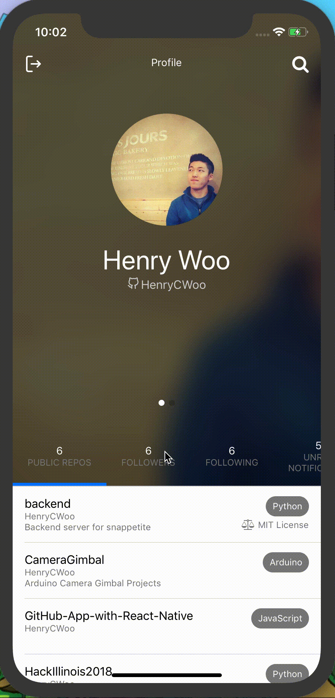

# GitHub App with React Native

This mobile app is a convenient way for users to interact with GitHub through their mobile devices.
Users can look for GitHub users, find repositories, and view their notifications.

## Demo

Upon starting the app, users will be greeted with a friendly login screen. Users can choose to login using Basic Authentication or Auth2.0. Then after logging in, they will see a rendering of their profile and description.

Selecting a different user from the profile screen will render that user's profile and description.

Selecting a repository will display a description and some information about the repository. There is also an option to head to the original GitHub page via the external link button in the top right corner.

The search functionality allows users to find other users and repositories.

## Built With

* [React Native](https://facebook.github.io/react-native/) - The mobile framework used
* [npm](https://www.npmjs.com/) - Package Manager
* [GitHub API](https://developer.github.com/v3/) - Used to generate the app's content

## Authors

**Henry Woo** - CS@Illinois

## License

This project is licensed under the MIT License - see the [LICENSE.md](LICENSE) file for details
